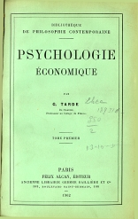
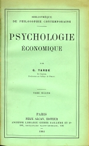

Gabriel TARDE, _Psychologie économique_, Tome premier, Paris : Félix Alcan, Éditeur, 1902, 383 pp. Collection : Bibliothèque de philosophie contemporaine. Ancienne Librairie Germer Baillière et Cie.

Gabriel TARDE, Psychologie économique, Tome second, Paris: Félix Alcan, Éditeur, 1902, 449 pp. Collection : Bibliothèque de philosophie contemporaine.

Cette version a été numérisée par Réjeanne Toussaint pour le site Les Classiques des sciences sociales ([doi](http://dx.doi.org/doi:10.1522/cla.tag.psy )).

Toutes les erreurs de numérisation peuvent être corrigées directement sur [Github](https://github.com/opensciencessociales/psycho_echo) en se référant à la version disponible sur le site Gallica ([tome 1](http://gallica.bnf.fr/ark:/12148/bpt6k64812c), [tome 2](http://gallica.bnf.fr/ark:/12148/bpt6k23531r/f2.image)).

L'ouvrage est désormais dans le domaine public.
